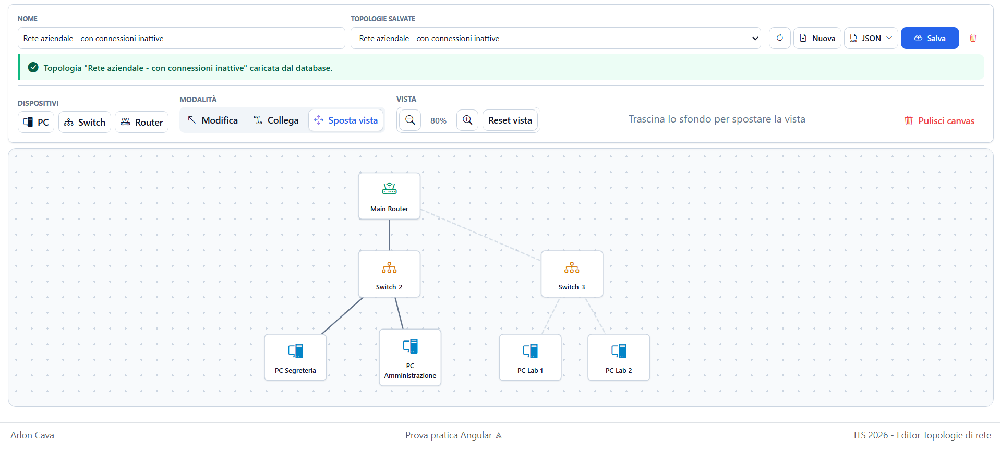

# Editor di topologie di rete

Applicazione web per progettare e archiviare topologie di rete composte da PC, switch e router. L'editor Angular permette di disporre e collegare i dispositivi, modificarne le proprietà e trasferire le topologie tramite JSON. Un backend Express espone le API REST per la persistenza su MongoDB, con validazione della struttura e dei vincoli dei collegamenti.

**Stack tecnologico:** Angular 21 · TypeScript · Signals · RxJS · HTML/CSS · SVG · Bootstrap Icons · Node.js · Express 5 · Zod · MongoDB · Mongoose · Docker Compose · Swagger UI · Vitest

## Panoramica

Il sistema gestisce una rappresentazione grafica della rete: il frontend mantiene in memoria dispositivi e connessioni durante l'editing e invia l'intera topologia al backend quando l'utente sceglie **Salva**. Il backend valida il payload e lo archivia come documento MongoDB.

L'editor e l'importazione/esportazione JSON sono utilizzabili anche senza API disponibile. L'archivio remoto richiede invece backend e database attivi.

## Funzionalità

- Inserimento, trascinamento ed eliminazione di PC, switch e router sul canvas.
- Modalità **Modifica**, **Collega** e **Sposta vista**, con pan, zoom dal 50% al 200% e ripristino della vista.
- Collegamenti SVG selezionabili, aggiornati durante lo spostamento dei dispositivi.
- Pannello dettagli aperto con click destro, per modificare nome, stato e proprietà specifiche del dispositivo.
- Controlli su IPv4, IP duplicati, nomi, auto-collegamenti, connessioni duplicate e capacità delle porte degli switch.
- Creazione, elenco, caricamento, aggiornamento ed eliminazione delle topologie salvate tramite REST API.
- Importazione JSON con validazione prima della sostituzione dello stato corrente ed esportazione per backup o scambio dei dati.
- Pulizia del canvas con conferma e rimozione dei collegamenti associati ai dispositivi eliminati.

La creazione di una connessione imposta entrambi gli estremi su `Online`; la sua rimozione non li imposta su `Offline`. Il toggle dello stato aggiorna subito la topologia locale, mentre gli altri campi del pannello vengono applicati con **Salva modifiche**. Per persistere questi cambiamenti occorre usare **Salva** nella toolbar.

## Architettura

```text
frontend/src/app/
├── components/
│   ├── canvas/                        editor e interazioni grafiche
│   ├── device-details/                form dei dettagli del dispositivo
│   └── topology-persistence-toolbar/  comandi di archivio e import/export
├── services/
│   ├── topology-service.ts            stato, regole e coordinamento persistenza
│   └── topology-api-service.ts        client HTTP
└── types/                             modelli e conversione JSON

backend/src/
├── app.ts                             middleware, health check ed errori
├── server.ts                          connessione MongoDB e avvio HTTP
├── routes/                            operazioni REST sulle topologie
├── schemas/                           validazione Zod
├── models/                            documenti Mongoose e contatore ID
└── openapi.ts                         descrizione OpenAPI
```

`Canvas` gestisce selezioni, modalità, pan e zoom e riceve gli eventi dai componenti dettagli e toolbar. `TopologyService` conserva lo stato con Signals, applica le regole di dominio, gestisce il JSON e coordina le operazioni remote tramite `TopologyApiService`. Quest'ultimo si occupa del trasporto HTTP con `HttpClient` e RxJS.

Nel backend, le route validano le richieste con Zod prima di accedere ai modelli Mongoose. Un middleware traduce errori di validazione, conflitti e risorse mancanti in risposte JSON.

## Modello dati

| Entità | Campi principali |
| --- | --- |
| `Topology` | `id`, `name`, `devices`, `connections` |
| `Device` comune | `id`, `type`, `name`, `x`, `y`, `status` |
| `PC` | campi comuni; `ip`, `hostname`, `operatingSystem` facoltativi |
| `Switch` | campi comuni; `portCount`; `ip` e `model` facoltativi |
| `Router` | campi comuni; `ip`, `hostname`, `model` facoltativi |
| `Connection` | `id`, `sourceId`, `targetId` |

`Device` è una union discriminata da `type`; lo stato può essere `Online` o `Offline`. Gli ID di dispositivi e connessioni sono interi positivi e univoci all'interno della rispettiva topologia. L'IP, se presente, deve essere un IPv4 valido e non duplicato.

Ogni connessione deve riferirsi a due dispositivi distinti esistenti. I collegamenti A–B e B–A sono considerati duplicati. Ogni collegamento occupa una porta per ciascuno switch coinvolto: i nuovi switch hanno 8 porte, modificabili nel pannello dettagli senza scendere sotto il numero di connessioni presenti. PC e router non hanno un limite di porte nel modello.

## API

URL locale del backend: `http://localhost:3000`.

| Metodo | Endpoint | Descrizione |
| --- | --- | --- |
| `GET` | `/api/health` | Stato API e connessione al database; `200` oppure `503` |
| `GET` | `/api/topologies` | Elenco delle topologie complete |
| `GET` | `/api/topologies/:id` | Lettura di una topologia |
| `POST` | `/api/topologies` | Creazione con ID assegnato dal server |
| `PUT` | `/api/topologies/:id` | Sostituzione di nome, dispositivi e connessioni |
| `DELETE` | `/api/topologies/:id` | Eliminazione, con risposta `204` |

Creazione e aggiornamento accettano `name`, `devices` e `connections`, senza l'ID della topologia. La validazione limita i payload a 500 dispositivi e 2.000 connessioni; il parser JSON accetta richieste fino a 1 MB.

La documentazione interattiva è disponibile su [Swagger UI](http://localhost:3000/api-docs), con il documento [OpenAPI JSON](http://localhost:3000/api-docs/openapi.json). Le operazioni sulle topologie richiedono MongoDB attivo.

## Esempio di utilizzo

1. In modalità **Modifica**, selezionare PC e switch dalla toolbar e inserirli sul canvas.
2. Passare a **Collega** e selezionare prima un dispositivo, poi l'altro.
3. Aprire i dettagli con click destro e impostare le proprietà desiderate.
4. Assegnare un nome alla topologia e premere **Salva** per archiviarla nel database.
5. Esportare il JSON oppure ricaricare la topologia dall'elenco dell'archivio.

Per provare l'importazione sono disponibili i file in [`docs/esempi_json`](docs/esempi_json). Una topologia importata non conserva un ID remoto: il successivo salvataggio crea una nuova voce nell'archivio.



Altre schermate: [dettagli del dispositivo](docs/screenshots/Dettaglio_Device.png), [salvataggio](docs/screenshots/Salvataggio_TopologiaDB.png) e [Swagger UI](docs/screenshots/Swagger_Overview.png).

## Database

MongoDB 8 viene avviato localmente tramite Docker Compose; Mongoose gestisce l'accesso ai dati. Ogni topologia è un documento con array annidati di dispositivi e connessioni. Questi array usano `Schema.Types.Mixed`: la validazione dettagliata del contenuto avviene nello schema Zod delle richieste.

Un contatore incrementato atomicamente assegna l'ID numerico pubblico della topologia, indicizzato e univoco. Le risposte API omettono `_id` e i timestamp interni. Il volume Docker `mongodb_data` conserva i dati tra gli arresti del container. I JSON di esempio si importano dall'editor e si salvano esplicitamente; non costituiscono un seed automatico.

## Avvio del progetto

### Prerequisiti

- Node.js **22.12 o successivo della serie 22**, oppure **24 o superiore**, in accordo con i requisiti delle dipendenze frontend e backend.
- npm.
- Docker con Docker Compose per il database locale, oppure un'istanza MongoDB configurata tramite `MONGODB_URI`.

### Installazione

Dalla cartella principale, installare le dipendenze dei due progetti:

```powershell
cd backend
npm ci
cd ../frontend
npm ci
cd ..
```

### Configurazione

Se `backend/.env` non esiste, crearlo dal file di esempio:

```powershell
Copy-Item backend/.env.example backend/.env
```

| Variabile | Utilizzo |
| --- | --- |
| `PORT` | Porta HTTP del backend; valore predefinito `3000` |
| `CORS_ORIGIN` | Origini frontend consentite, separate da virgole; predefinita `http://localhost:4200` |
| `MONGODB_URI` | Stringa di connessione MongoDB, obbligatoria per avviare il backend |
| `MONGO_ROOT_USERNAME` | Utente inizializzato dal container MongoDB |
| `MONGO_ROOT_PASSWORD` | Password inizializzata dal container MongoDB |

Mantenere coerenti la stringa di connessione e le credenziali del container. La configurazione di esempio è destinata allo sviluppo locale. MongoDB viene esposto sulla porta `27017`.

Il client frontend usa l'URL fisso `http://localhost:3000/api/topologies` in `frontend/src/app/services/topology-api-service.ts`: cambiare la porta del backend richiede di aggiornare anche questo indirizzo.

### Avvio

Primo terminale, dalla cartella principale:

```powershell
cd backend
docker compose up -d mongodb
npm run dev
```

Docker Compose avvia **solo MongoDB**. Il backend attende la connessione al database prima di aprire il server HTTP.

Secondo terminale, dalla cartella principale:

```powershell
cd frontend
npm start
```

Aprire [l'editor](http://localhost:4200) e verificare il backend tramite [health check](http://localhost:3000/api/health).

In ciascuna cartella, `npm run build` compila il relativo progetto. Nel backend, `npm start` esegue `dist/server.js` dopo la compilazione; nel frontend, `npm start` avvia il server di sviluppo Angular.

## Test

Il frontend usa Vitest tramite il builder di test Angular, con test per servizi, regole della topologia, import/export JSON e componenti dell'editor. Sono stati corretti i test dell'app e del salvataggio dei dettagli sul canvas, aggiungendo un caso per il nome del dispositivo non valido.

La suite backend è stata ampliata: verifica i vincoli dello schema Zod (campi, IPv4, duplicati, collegamenti e limiti) e le API HTTP Express (health check, CRUD, OpenAPI e gestione degli errori). I test HTTP usano mock della persistenza e non richiedono MongoDB attivo.

```powershell
# Dalla cartella principale: test backend
cd backend
npm test
cd ..

# Test frontend in esecuzione singola
cd frontend
npm test -- --watch=false
```

## Workflow GitHub Actions

I workflow [Backend tests](.github/workflows/backend-tests.yml) e [Frontend tests](.github/workflows/frontend-tests.yml) si avviano a ogni push, pull request o esecuzione manuale. Su Ubuntu configurano Node.js 22 con cache npm, installano le dipendenze con `npm ci` ed eseguono rispettivamente `npm test` e `npm test -- --watch=false`. Il frontend dispone di un limite di memoria Node.js di 4 GB. Un test fallito fa fallire il relativo controllo.

I workflow nelle cartelle `backend/.github` e `frontend/.github` servono se i due progetti vengono pubblicati come repository separati; nel repository attuale GitHub esegue quelli nella cartella `.github/workflows` alla radice.

## Aspetti tecnici principali

- Stato reattivo con Signals e valori derivati tramite `computed`, inclusa l'attivazione delle connessioni in base allo stato degli estremi.
- Pointer Events per il trascinamento e trasformazioni della vista che mantengono separate coordinate dei dispositivi, pan e zoom.
- Modello TypeScript discriminato per le proprietà specifiche dei dispositivi.
- Validazione strutturale e referenziale dei dati importati e dei payload API, inclusi duplicati e capacità delle porte.
- Contratto REST documentato con OpenAPI e gestione centralizzata degli errori nel backend.

## Scelte progettuali

- **Persistenza dell'intera topologia:** il salvataggio esplicito invia un insieme completo di dispositivi e connessioni, senza generare richieste durante ogni trascinamento. Il documento MongoDB rispecchia questa unità di lavoro.
- **Separazione tra stato e trasporto HTTP:** `TopologyService` concentra regole e coordinamento; `TopologyApiService` raccoglie le chiamate remote senza applicare regole di dominio.
- **HTML per i dispositivi e SVG per i collegamenti:** il template mantiene i binding e gli eventi Angular e aggiorna le linee a partire dalle coordinate degli estremi.
- **JSON portabile:** import/export consente di trasferire topologie anche senza backend, mantenendo distinta l'importazione dal salvataggio remoto.

## Limitazioni

- Non sono implementate autenticazione e separazione dell'archivio per utente.
- Lo stato `Online`/`Offline` è una proprietà dell'editor: non viene verificata la raggiungibilità di dispositivi reali e non vengono simulati traffico o protocolli di rete.
- Le modifiche restano in memoria fino al salvataggio o all'esportazione; non è previsto un salvataggio automatico locale.
- L'URL API è fisso nel client e Docker Compose include soltanto il database.
- I test HTTP del backend usano mock della persistenza: l'integrazione con un database MongoDB reale non è coperta.

## Possibili sviluppi

- Autenticazione e gestione delle topologie per utente.
- Configurazione dell'URL API per ambiente e containerizzazione di frontend e backend.
- Aggiunta di test d'integrazione delle API con MongoDB reale.
- Salvataggio di bozze locali e avvisi per le modifiche non salvate.

## Competenze consolidate

- Gestione dello stato reattivo e delle interazioni grafiche in Angular.
- Modellazione TypeScript e controllo dei vincoli di un grafo di dispositivi.
- Progettazione e integrazione di API REST con validazione e gestione degli errori.
- Persistenza documentale con MongoDB e Mongoose.
- Configurazione del database locale con Docker Compose e documentazione API con OpenAPI.

## Contesto

Progetto sviluppato durante il percorso formativo ITS Academy, per applicare Angular alla realizzazione di un editor interattivo e integrarlo con un backend REST e una persistenza documentale.

## Autore

Arlon Cava
